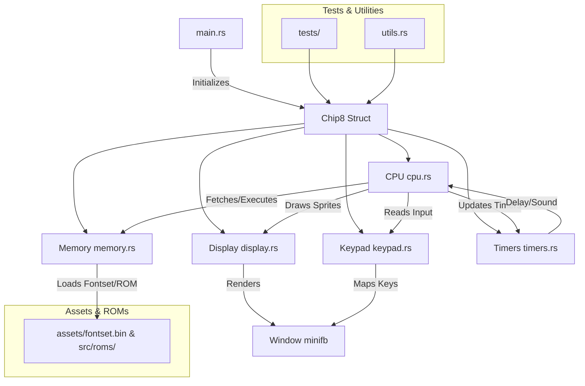

[](https://github.com/gongahkia/ditto/releases/tag/2.0.0) 
[](https://github.com/gongahkia/ditto/releases/tag/2.0.0) 

# `Ditto`

A simple [CHIP-8](https://en.wikipedia.org/wiki/CHIP-8) Emulator made to practise [this stack](#stack).

## Stack

* *Frontend*: [HTML](https://developer.mozilla.org/en-US/docs/Web/HTML), [CSS](https://developer.mozilla.org/en-US/docs/Web/CSS), [WebAssembly](https://www.rust-lang.org/what/wasm), [JavaScript](https://developer.mozilla.org/en-US/docs/Web/JavaScript)
* *Script*: [Rust](https://www.rust-lang.org/), [Bash](https://www.gnu.org/s/bash/)
* *Package*: [Docker](https://www.docker.com/)
* *CI/CD*: [Github Actions](https://github.com/features/actions)

## Usage

The below instructions are for running `Ditto` on your client machine.

1. Execute the below.

```console
$ git clone https://github.com/gongahkia/ditto && cd ditto
```

2. Build the [Docker](./Dockerfile) Image.

```console
$ docker build -t chip8-ditto .
```

3. Run the `Ditto` [CHIP-8 Emulator](./src/chip8/).

```console
$ docker run --rm -it chip8-ditto
```

4. Run `Ditto` [Tests](./tests/).

```console
$ docker run --rm -it chip8-ditto test
```

5. Alternatively run the below to run the `Ditto` [Web App](./web/) on a local server.

```console
$ npm install -g http-server && cd web
$ http-server -p 8080
```

## Architecture



## Reference

The name `Ditto` is in reference to [Ditto](https://bulbapedia.bulbagarden.net/wiki/Ditto_(Pok%C3%A9mon)) (also known as [Metamon](https://en.wikipedia.org/wiki/Ditto_(Pok%C3%A9mon)) メタモン), a [Normal](https://bulbapedia.bulbagarden.net/wiki/Normal_(type))-type [Generation I](https://bulbapedia.bulbagarden.net/wiki/Generation_I) [Pokémon](https://bulbapedia.bulbagarden.net/wiki/Pok%C3%A9mon_(species)) able to [breed](https://bulbapedia.bulbagarden.net/wiki/Pok%C3%A9mon_breeding) with most other Pokémon.

<div align="center">
    
</div>

## Research

* [*Guide to making a CHIP-8 emulator*](https://tobiasvl.github.io/blog/write-a-chip-8-emulator/) by Tobias V Langhoff
* [*Building a CHIP-8 Emulator [C++]*](https://austinmorlan.com/posts/chip8_emulator/) by Austin Morlan
* [*How to Create Your Very Own Chip-8 Emulator*](https://www.freecodecamp.org/news/creating-your-very-own-chip-8-emulator/) by freeCodeCamp
* [*Writing a Chip-8 Emulator from Scratch in JavaScript*](https://www.taniarascia.com/writing-an-emulator-in-javascript-chip8/) by tania.dev
* [*Building a Chip-8 Emulator in Go*](https://medium.com/@bradford_hamilton/building-a-chip-8-emulator-in-go-9f137ec5d71c) by Bradford Lamson-Scribner
* [*CHIP-8 interpreters*](https://emulation.gametechwiki.com/index.php/CHIP-8_interpreters) by Emulation General Wiki
